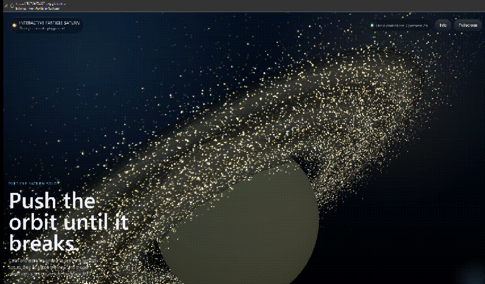

# 🪐 Interactive Particle Saturn

> 🎬 一个基于 Three.js 的“有生命感”的土星交互系统
> 🎬 A cinematic, gesture-driven particle system built with Three.js

---

A cinematic Three.js experiment featuring a particle-based Saturn system with gesture interaction.

---

## 🌌 Preview

<p align="center">
  
</p>

---

## ✨ Features

- 🪐 Realistic Saturn-inspired planet and rings  
- 🌠 Particle-based dynamic ring system  
- ✋ Gesture / mouse interaction  
- 🎬 Cinematic motion and lighting  

---

## 🌍 在线体验 | Live Demo

- 🚀 Alibaba Cloud / 阿里云：http://47.109.136.234/projects/particle-saturn/
- 🌐 GitHub Pages：https://1379475267-svg.github.io/interactive-particle-saturn/

---

## 🚀 项目定位 | Project Positioning

这个项目不仅仅是视觉效果，而是一个交互系统：

This project is not just a visual effect, but an interactive system:

* 🌌 粒子驱动的三维交互系统
  A particle-driven 3D interactive system

* 🖐️ 基于手势的实时控制
  Real-time gesture-based interaction

* 🎮 “物理 + 感知 + 视觉”的融合探索
  Exploration of physics, perception, and visual interaction

---

## 🧩 项目结构 | Project Structure

| 模块         | 说明                                              |
| ---------- | ----------------------------------------------- |
| 🪐 主项目     | 当前完整交互系统                                        |
| 🧪 手势 Demo | http://47.109.136.234/projects/living-saturn/ |

| Module          | Description                                     |
| --------------- | ----------------------------------------------- |
| 🪐 Main Project | Full interactive system                         |
| 🧪 Gesture Demo | http://47.109.136.234/projects/living-saturn/ |

👉 Demo 用于验证手势控制，本项目用于完整表现
👉 The demo validates gesture control, while this is the full experience

---

## ✨ 项目亮点 | Highlights

* 🪐 粒子构成的土星（核心 + 多层环）
  Particle-based Saturn (core + multi-layer rings)

* 🖐️ 实时手势控制（MediaPipe）
  Real-time hand tracking with MediaPipe

* 🪐 类开普勒轨道运动
  Kepler-inspired orbital motion

* 💥 混沌爆散系统
  Chaos burst system

* 🌫 多层粒子结构（核心 / 环 / 拖尾 / 尘埃）
  Multi-layer particle system (core / rings / trail / dust)

* 🎛 电影级动态过渡
  Cinematic transitions

---

## 🎮 交互方式 | Interaction

| 操作         | 效果        |
| ---------- | --------- |
| 🖐️ 张开手    | 放大土星，提高亮度 |
| ✊ 收拢手      | 收缩系统，恢复稳定 |
| 🖱️ 拖拽     | 旋转视角      |
| 💥 双击 / 空格 | 触发爆发      |
| ⛶ 全屏       | 沉浸模式      |

| Action                  | Effect                   |
| ----------------------- | ------------------------ |
| 🖐️ Open hand           | Expand & brighten Saturn |
| ✊ Close hand            | Contract & stabilize     |
| 🖱️ Drag                | Rotate camera            |
| 💥 Double click / Space | Trigger burst            |
| ⛶ Fullscreen            | Immersive mode           |

---

## 🧠 系统设计 | System Design

### 1️⃣ 手势层 | Gesture Layer

使用 MediaPipe 进行手部关键点检测
Extract hand landmarks using MediaPipe

计算手掌张开程度作为控制变量
Compute hand openness as control input

---

### 2️⃣ 映射层 | Mapping Layer

```text
openRatio → scale
openRatio → brightness
openRatio → chaos
```

手势直接驱动视觉参数
Gesture directly drives visual parameters

---

### 3️⃣ 粒子系统 | Particle System

* 核心粒子球
  Dense particle core

* 多层轨道环
  Multi-layer orbital rings

* 拖尾与尘埃
  Trail and dust for depth

---

### 4️⃣ 混沌系统 | Chaos System

从稳定轨道逐渐进入混沌状态
Transition from stable orbit to controlled chaos

实现“秩序 → 失控 → 重建”的过程
Simulates order → chaos → reconstruction

---

## 🧠 技术栈 | Tech Stack

* Three.js (WebGL)
* MediaPipe (Hand Tracking)
* GLSL Shader
* JavaScript (ES Modules)
* GitHub Pages

---

## ⚠️ 注意事项 | Notes

* 需要开启摄像头权限
  Camera permission is required

* 推荐桌面端 Chrome
  Best experience on desktop Chrome

* 首次加载需要时间
  Initial load may take a few seconds

---

## 🔥 后续方向 | Future Work

* 🎵 音频驱动
  Audio reactive system

* 🤲 多手势控制
  Multi-gesture interaction

* 🌍 多场景扩展
  Multi-scene system

* 🧠 更真实物理
  More realistic physics

---

## ## 👤 作者 | Author

**费浩然 | Haoran Fei**

* 🎓 电子信息科学与技术
  Electronic Information Science & Technology

* 💡 方向：交互图形 / 嵌入式 / 创意编程
  Direction: Interactive Graphics / Embedded / Creative Coding

* 🔗 https://github.com/1379475267-svg

---
